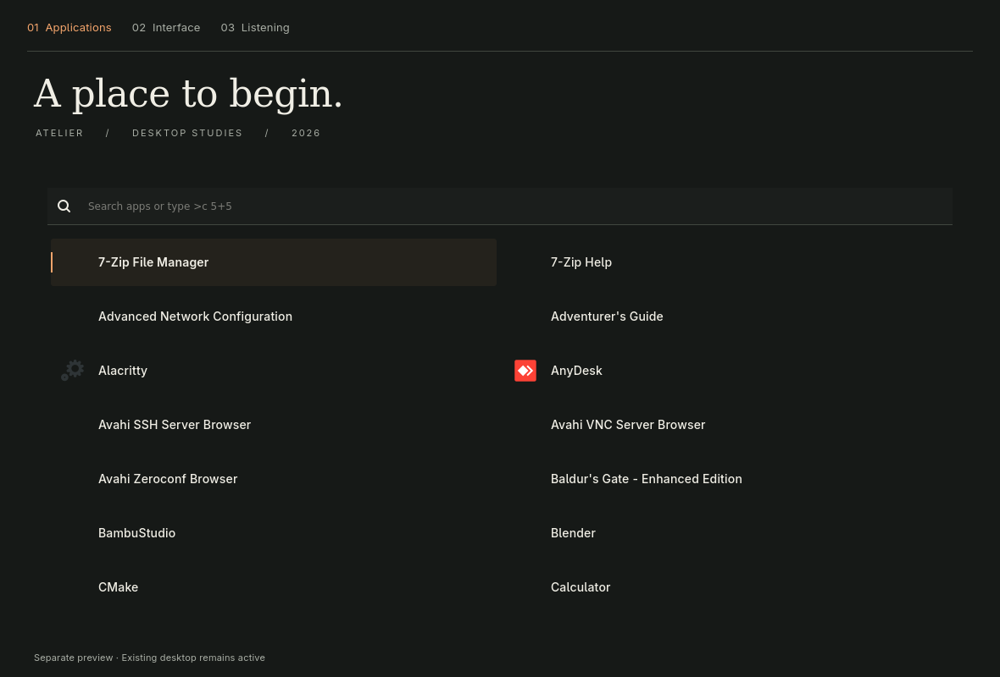
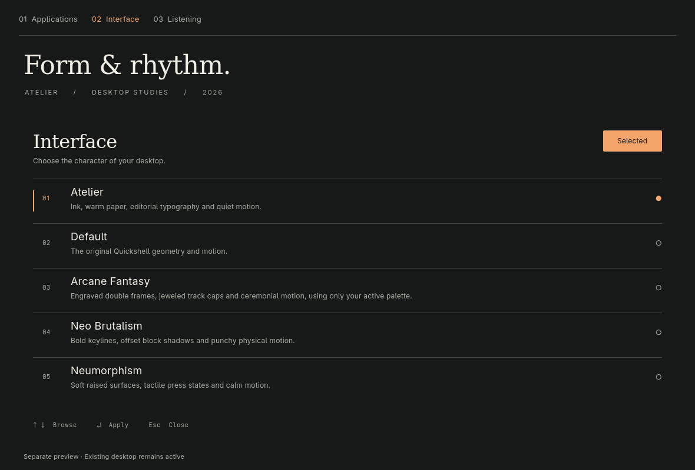
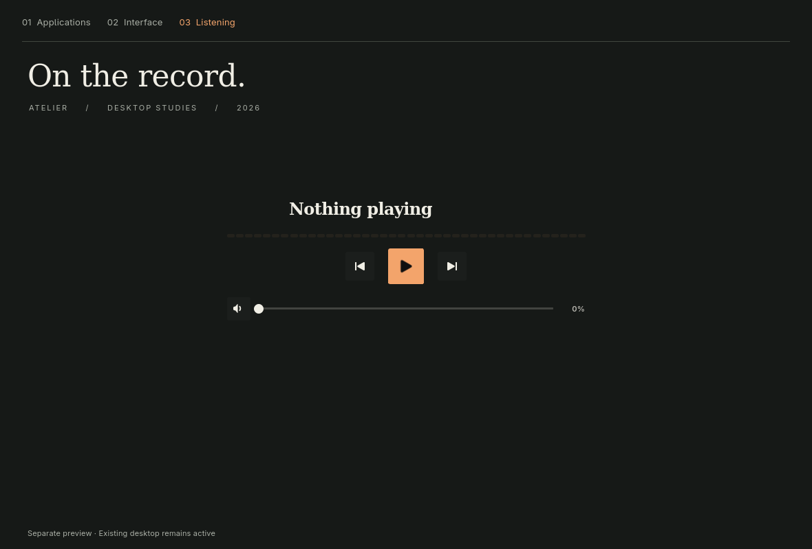

# Atelier

Eine neue grafische Richtung für dieses Quickshell-Setup: dunkle Tinte,
warmes Papier, Apricot als Funktionsakzent. Eine ruhige Desktop-Oberfläche
mit typografischer Hierarchie, durchgehenden Flächen und feinen Linien.

## Arbeitskopie und Original

Dieses Verzeichnis ist ein eigenständiges lokales Git-Repository.

- `main`: gesicherter Ausgangszustand einschließlich der Caelestia-Quellen.
- `redesign/atelier`: die neue Gestaltung.
- Das laufende Setup im übergeordneten Verzeichnis wurde nicht umgeschaltet.
- Persönliche Chatverläufe und Nutzungsstatistiken wurden nicht ins Repository kopiert.

## Vorschau

Aus diesem Verzeichnis:

```sh
bash scripts/review_atelier.sh show
```

Öffnet ein normales Fenster mit den echten Launcher-, Interface- und
Medienkomponenten. Es ersetzt keine Desktop-Leiste und startet keinen
Sperrbildschirm. Die großen Überschriften oberhalb der Komponenten gehören
zur Vorschau, nicht zur Desktop-Leiste. Die Vorschau ist interaktiv:
Anwendungen lassen sich starten, die Interface-Auswahl betrifft diese Kopie,
und die Medienbedienung verwendet die vorhandenen Audiofunktionen.





## Gestaltungsregeln

- Adwaita Sans für Bedienelemente, DejaVu Serif für große Überschriften und
  die Sperrbildschirm-Uhr, Adwaita Mono für technische Beschriftungen.
- Tinte `#161917`, Papier `#f0eee5`, Akzent `#f3a46b`, Trennlinie `#41473f`.
- Aktive Elemente erhalten eine Akzentlinie oder eine sparsame Farbfläche.
- Keine federnden Einblendungen; kurze Bewegungen und weiche Übergänge.
- Flächen werden über Abstände und Linien gegliedert. Bilder dürfen als
  eigenständige Motive wirken, ohne übereinandergestapelte Karten.

Die Shell verwendet bewusst eine feste Palette. Wallpaper- und
Wallust-Werkzeuge bleiben vorhanden und können weiterhin andere Anwendungen
gestalten; die Atelier-Shell übernimmt deren Farben nicht automatisch.
Andere Interface-Themes sind weiterhin als alternative Geometrien auswählbar.

## Bereiche

| Bereich | Änderung |
| --- | --- |
| Haupt- und zusätzliche Monitorleisten | Durchgehende dunkle Leiste, freie Module, Fokusstrich an aktiven Anwendungen |
| Launcher, Befehle, Dateien, Rechner und KI | Gemeinsame Schrift- und Flächenregeln, Suche oben, Anwendungen als zweispaltige Zeilen |
| Uhr, Wetter, Netzwerk, Bluetooth, Ressourcen und Zwischenablage | Gemeinsame Popup-Fläche mit 24 px Innenabstand und scrollbar begrenzter Höhe |
| Benachrichtigungen, Toasts, Tray-Menüs und OSD | Einheitliche Schrift, Palette, Geometrie und reduzierte Bewegung |
| Medien | Zurückgenommenes Spektrum, größere Titel, feiner Lautstärkeregler |
| Interface-Auswahl | Vollständig neue nummerierte Liste mit Tastatursteuerung |
| Wallpaper, Animationen und Presets | Einzelne Bildvorschau statt Kartenstapel, reduzierte Rahmen und gemeinsame Typografie |
| Sitzungsmenü | Vier flache Aktionszeilen mit passender Pfeiltasten-Navigation |
| Sperrbildschirm und SDDM-Quellen | Asymmetrische Platzierung, große Serifenuhr, reduzierte Eingabeflächen |
| Mitgeliefertes Caelestia | Gemeinsame Schrift-, Radius- und Bewegungsdefaults sowie offene Einstellungsabschnitte |

Die Caelestia-Module bilden eine zusätzliche, eigenständige Shell. Ihr
Layout wurde nicht vollständig neu implementiert; die aktive Haupt-Shell
verwendet davon nur die Fuzzy-Suche. SDDM wurde nicht systemweit installiert.

## Prüfung

```sh
bash scripts/review_atelier.sh validate
bash scripts/review_atelier.sh capture
git diff --check
```

`validate` kompiliert die komplette Haupt-Shell mit ihren QML-Abhängigkeiten,
ohne sie zu instanziieren. Es braucht eine laufende Wayland-Sitzung.
`capture` rendert drei Ansichten der echten Komponenten mit dem Software-Backend.
Die Bilder wurden visuell geprüft; die Haupt-Shell kompiliert erfolgreich.
Der lokale QML-Formatter/Linter beendet sich bei den komplexen Dateien auch
im Originalzustand ohne Diagnose. Deshalb dient die tatsächliche
Quickshell-Kompilierung als maßgebliche Prüfung.

Ein vollständiger interaktiver Test aller Popups auf mehreren Monitoren,
der PAM-Anmeldung und des SDDM-Greeters steht noch aus. Diese Prüfungen
wurden nicht durch eine Änderung der laufenden Sitzung erzwungen.

Für eine spätere separate Sitzung kann `quickshell -p /absoluter/pfad/atelier`
verwendet werden. Die vollständige Shell startet ihre regulären Dienste und
Wallpaper-Wiederherstellung; sie ist deshalb nicht mit dem Vorschaufenster
gleichzusetzen. Autostart und systemweite Installation sind unverändert.
